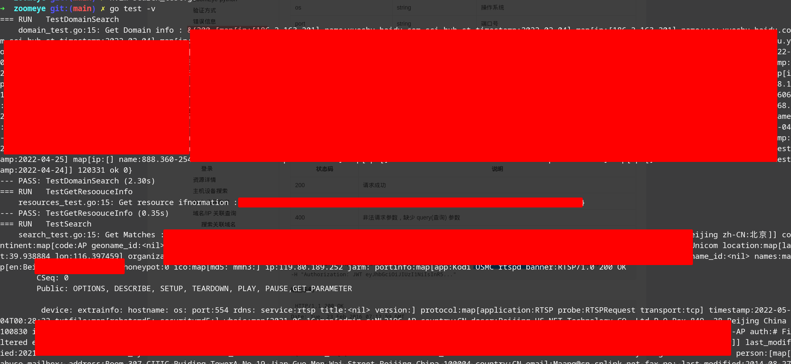

##### ZoomEye SDK for Golang
这是一个用Golang开发的zoomEye SDK,因为知道创宇提供的SDK只有python的版本,所以我就写了这个东西,用于自己个人使用的. API可能写得比较粗糙且暴力，但是从目前测试来看能用就行, 先凑合着用吧~_~


##### 怎么使用?
1. 首先你得有ZoomEye注册会员或VIP帐号(我的是注册会员所以vpi的接口没法测)
2. 设置环境变量,如下

```
# vim ~/.profile
export ZOOMEYE_API_KEY="your-api-key"
export ZOOMYEY_USERNAME="your-email-address"
export ZOOMYEY_PASSWORD="your-email-password"

export ~/.profile
```

这个库是在Arch Linux上开发测试的，其他平台没做测试


##### 简单测试结果



##### TODO
- [ ] 后续添加使用例子


---
that' all
